# Wavez

 ## Authors 
 > #### Kobe Braga (https://github.com/kobe-cb), 
 > #### Zergio Ruvalcaba (https://github.com/Zorten), 
 > #### Christopher De Santiago(https://github.com/Chrisdes-99)  
 
## Project Description
  #### Why is it important or interesting to you?
- Everyone likes music, everyone has their own differing opinions about music, and critics are overrated. Wavez is a program where you can either sign up or log in as a registered user and then go and rate music on a 0-5 scale and/or share your own thoughts on it with a review! Other users can then see what you have said, or you can see what they have to say about whatever music they listen to. You can search for artists, albums, or songs with existing ratings and/or reviews, and then you can choose to display all of the ratings/reviews for them. We found this interesting because it’s something that would be fun to make and (as far as we know) there’s not something like it out there. 

#### What languages/tools/technologies do you plan to use? (This list may change over the course of the project)
   - C++
   - Unit Testing
   - Valgrind
   
#### What will be the input/output of your project?
- Input will consist of ratings (on a five star scale) or reviews >* Output will consist of display of such reviews and ratings.

#### What are the three design patterns you will be using.
- Design Pattern 1: Strategy, a behavioral pattern, was chosen due to how we implement our functions. In this case, we can specify a 
“scan()” function that will do a scan based on what object the scan was called on. For example, if we called a scan and it had to do with music reviews, it’ll go to the scan from the reviews and not use the scan from the rating system. In each encapsulated scan(), we’ll impose different algorithms that work best for the objects that it deals with.
- Design Pattern 2: Composite, a structural pattern was chosen because we will have different songs/albums that the user can review. We can treat the song or album as an object that will have more objects in the form of more paths like reviews, song information, etc.  Therefore, Composite helps us manage this hierarchy of objects, and users don’t have to worry about the distinction between these objects. 
- Design Pattern 3: Facade, a structural pattern, was chosen due to how it allows us to hide the complexities of our system to the users. This allows us to give the user a higher-level simple interface that doesn’t overwhelm the user compared to as if we give them access to the subset systems too. Implementation wise, we are considering having a “main menu” where it’ll house all of our operations under simple commands for the user.

## Class Diagram

 Facade Pattern (Kobe): This pattern allows the LoginSystem to utilize both subclasses to operate a single function.
   
 
 
 Strategy Pattern (Zergio): This pattern encapsulates searching algorithms in order to implement the search feature for artists, albums, and songs.
  
 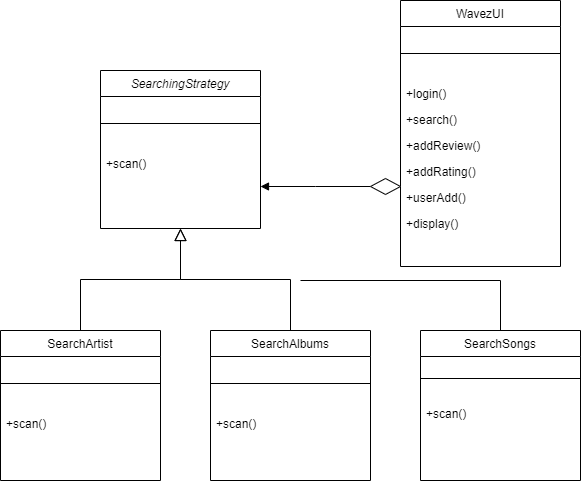
 
 Composite Pattern (Chris): This pattern is intended for multiple subclasses to use the same functionality for similar uses from a Base Class
  
  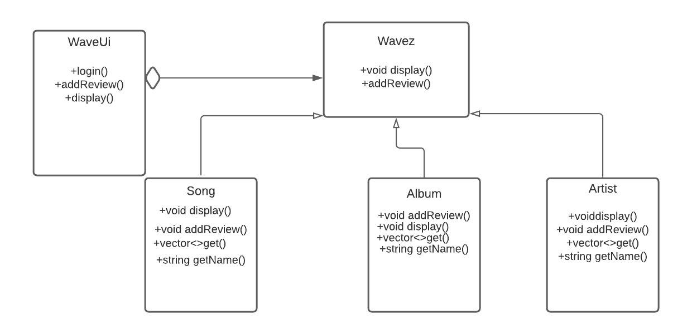
  
 ## Screenshots
 > Screenshots of the input/output after running your application
 
 - Deleting user accounts, creating user accounts, and logging into Wavez.
 
 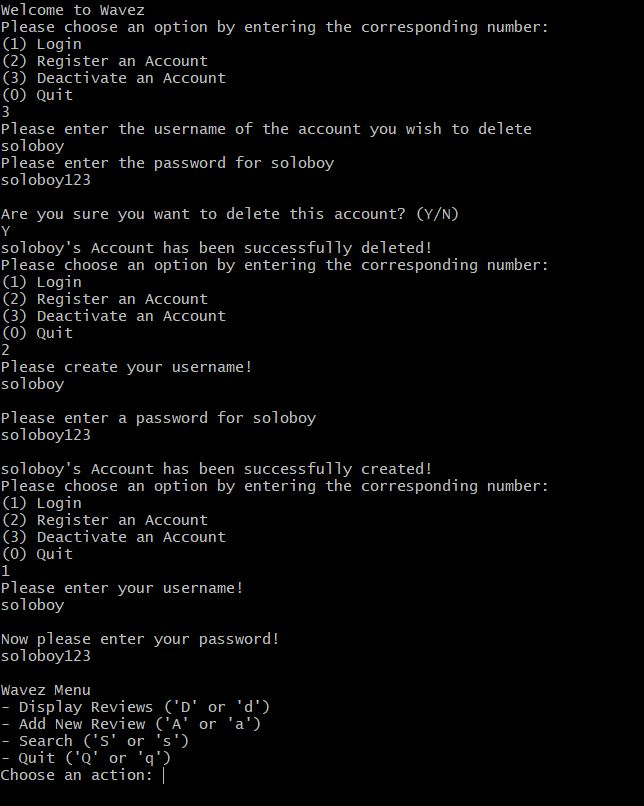
 
 
 - Displaying Artist's Album and Song Reviews. Displaying Artist's rating, which is the mean of all album ratings.
 
 
 
 - Adding Album to an Artist. Displaying multiple Albums and multpile Reviews for one Album. Displaying calculated Artist rating.
 
 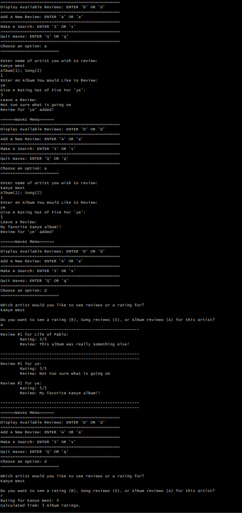
 
 - Adding a Song to an Artist. Adding extra Reviews to one Song. Displaying multiple Songs and multiple Reviews for one Song.
 
 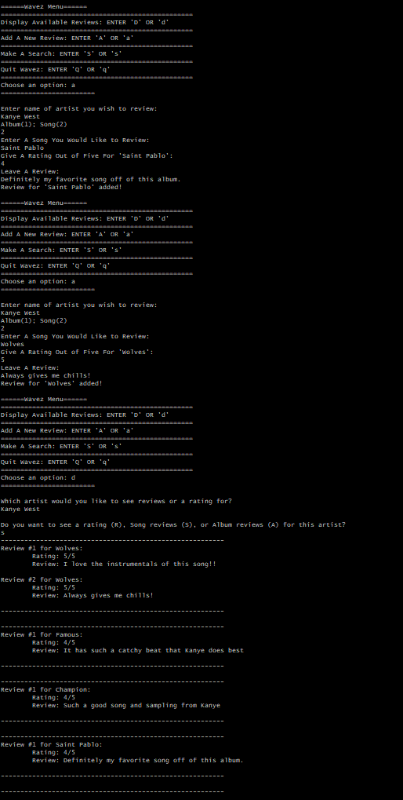
 
 - Searching for an Artist and displaying all their Reviews.
 
 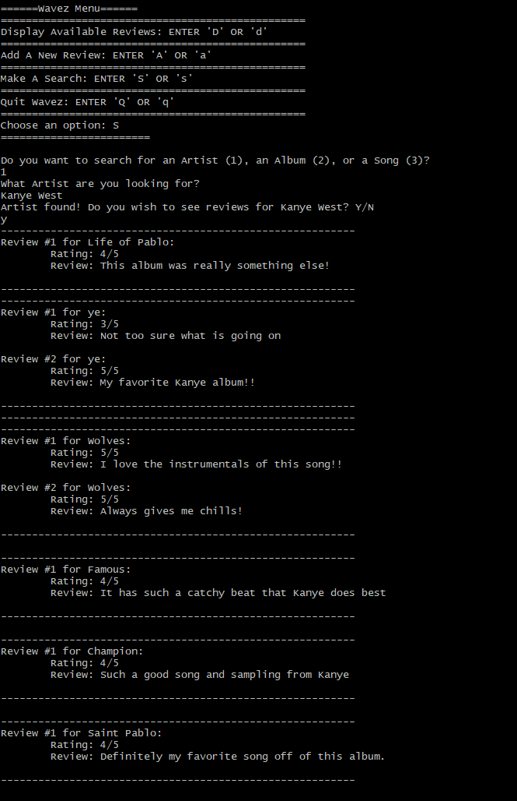

 - Searching for a Song and displaying all their Reviews.

 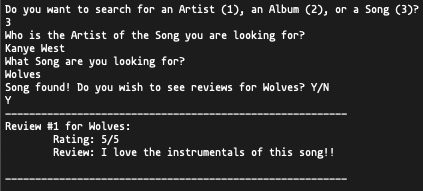

 - Searching for an Album and displaying all their Reviews.

 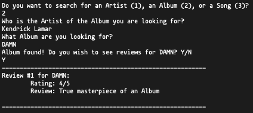

 - Error message when incorrect response to Search

 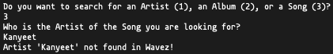

 - Error message when incorrect response to Display

 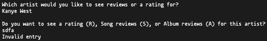

 - Error message when incorrect response to Adding a review

 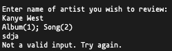

 - Invalid Input avoidance in main menu

 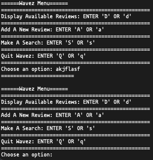

## Installation/Usage
#### Welcome to Wavez!
 * To begin installing our program, go ahead and download the files via git clone or manually downloading.
 * Afterwards, run [cmake .] as well as [make] to compile Wavez from its source code.
 * This will create an executable, "wavez" where you will execute [./wavez] to begin running Wavez.
 * You will be prompted with initial questions regarding how you want Wavez to function.
 * Follow the prompts and proceed to navigate our ease-of-use command-line User Interface!

## Testing
#### GoogleTest
 - Our project, Wavez, was tested via the implementation of the googletest submodule. Via this implementation, we included multiple test files where we developed tests for many functions in each class. This allows us to see if the functions are functioning to our own liking and allows us to see if any of them are prone to failure. Our tests are located in the folder, "tests/", where there are ".hpp" files that correlate to the general area they test in.
